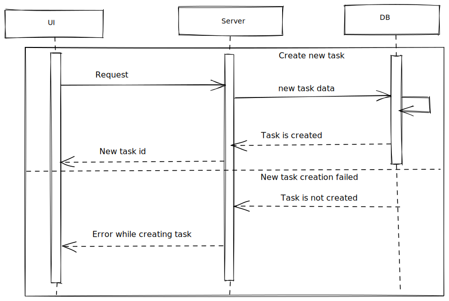

# Create task



## Create task form

Required fields:

- task name;
- task type;
- planned date start;
- planned date end;

Optional fields:

- actual date start;
- actual date end;

Standard validation.

## Request

Request body (POST):

```
{
    data: {
        taskName: string,
        taskType: TaskType, // should one of predefined types
        plannedDateStart: Date,
        plannedDateEnd: Date,
        actualDateStart?: Date,
        actualDateEnd?: Date,
        userId: UUID, // just in case. basically this info could be taken from token
    }
}
```

## Response

- If task is created:

```
{
    data: {
        taskId: UUID,
    }
}
```

Redirect user to the task page.

- If task is not created - respond with the ResponseBodyError interface.

Inform user about the error occured (toast or smth). Highlight form fields if needed.
