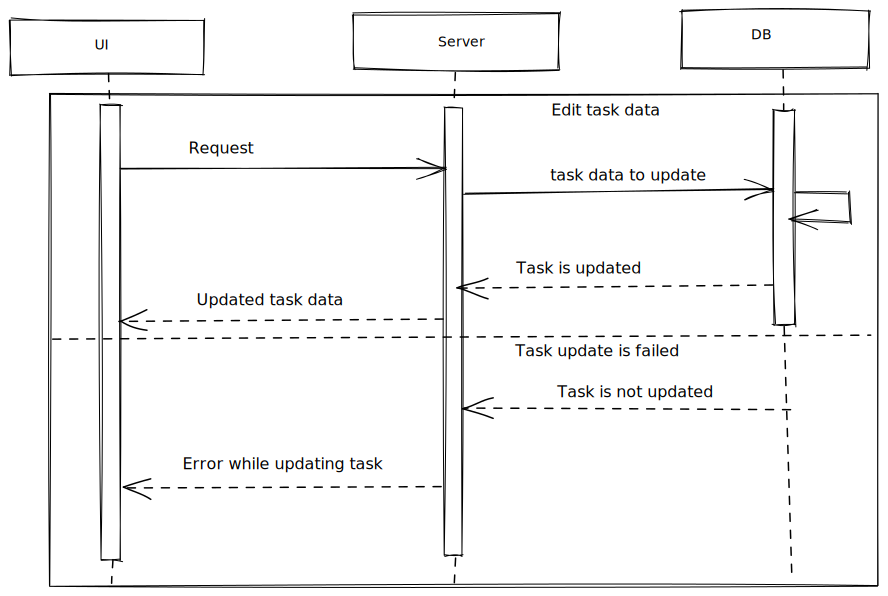

# Edit task



## Edit task form

Fields that can be updated:

- task name;
- actual date start;
- actual date end;

Standard validation.

## Request

Request body (POST/PUT - depends on API):
Body depends on how back-end is processing updates. Option 1 - just delete existing record and create new one with the same id and updated fields. Option 2: - update existing record prop by prop.

Option 1:

```
{
    data: {
        id: UUID,
        taskName: string,
        taskType: TaskType,
        plannedDateStart: Date,
        plannedDateEnd: Date,
        actualDateStart?: Date,
        actualDateEnd?: Date,
        userId: UUID,
    }
}
```

Option 2:

```
{
    data: {
        id: UUID,
        actualDateStart?: Date,
        actualDateEnd?: Date,
        userId: UUID,
    }
}
```

## Response

- If task is updated:

```
{
    data: {
        id: UUID,
        taskName: string,
        taskType: TaskType,
        plannedDateStart: Date,
        plannedDateEnd: Date,
        actualDateStart?: Date,
        actualDateEnd?: Date,
    }
}
```

- If task is not updated - respond with the ResponseBodyError interface.

Inform user about the error occured (toast or smth). Highlight form fields if needed.
