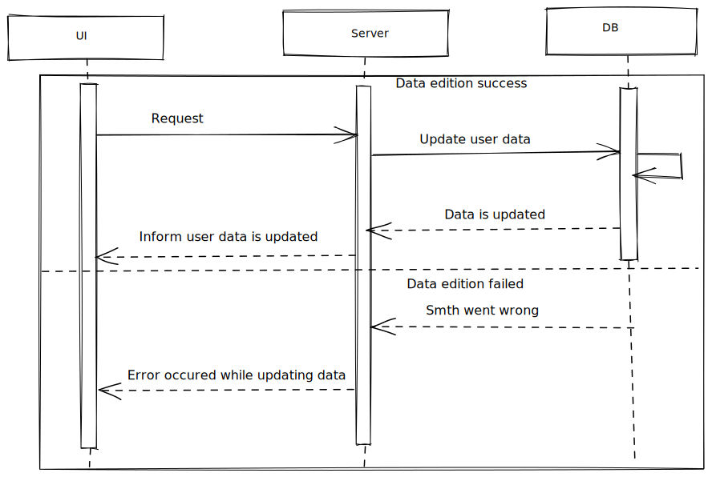

# Edit user



## Edit user form

User is able to:

- change name;
- change avatar;
- change secure question/answer to restore password.

All fields are optional.
If any of question/answer is filled in - another one should be filled in either.

## Request

Request body (POST/PUT - depends on API):

```
{
    data: {
        avatar: File | string | null,
        name: string | null,
        question: string | null,
        answer: string | null,
    }
}
```

The request body is provided as an example as it depends on how backend is processing data on update.
It could require to send all the fields or only fields that changed.

## Response

- If data is updated:

```
{
    data: {
        avatar: File | string | null,
        name: string | null,
        question: string | null,
        answer: string | null,
    }
}
```

- If data is not updated - respond with the ResponseBodyError interface.

Inform user about the error occured (toast or smth). Highlight form fields.
