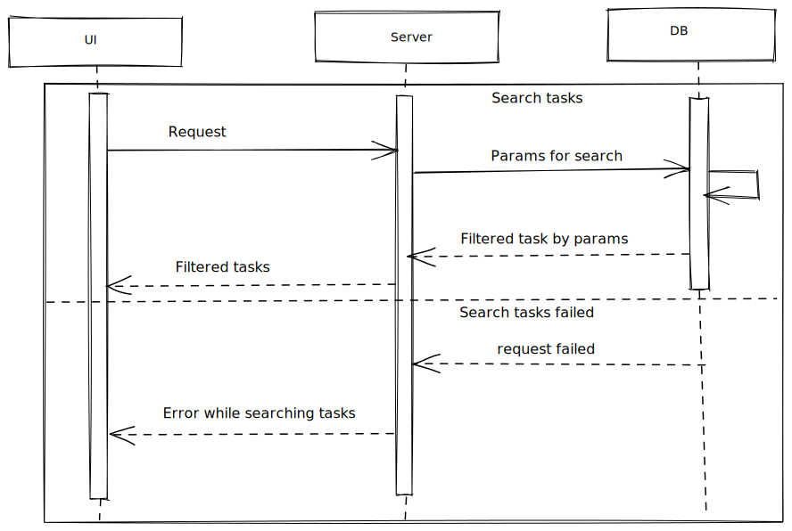

# Filter tasks



## Filter tasks form

All fields are optional. Any field change should be throttled or debounced.

## Request

Depends on back-end it might be GET or POST. I lean towards using GET.

## Response

- If search is successful:

```
{
    data: Task[]
}
```

- If search is failed - respond with the ResponseBodyError interface.
