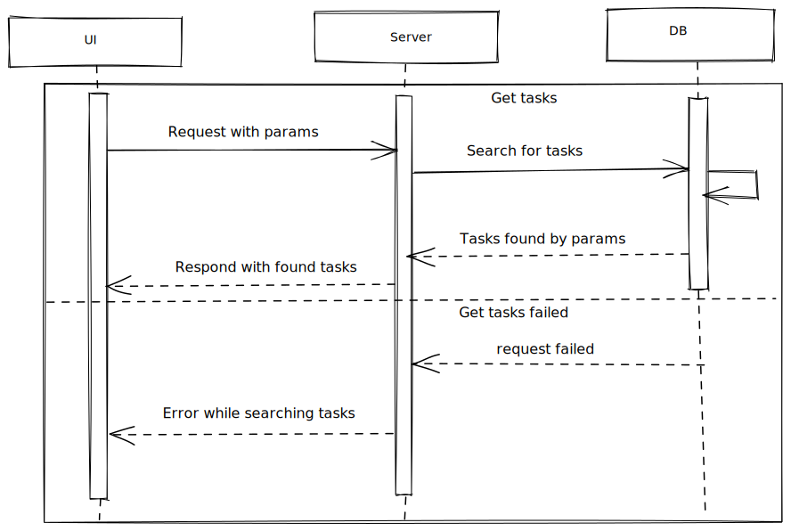

# Get tasks



## Get tasks form

All fields are optional. Any field change should be throttled or debounced.

## Request

Depends on back-end it might be GET or POST. I lean towards using GET.

## Response

- If search is successful:

```
{
    data: Task[]
}
```

- If search request is failed - respond with the ResponseBodyError interface.

## Note

This service might be used for getting single task
