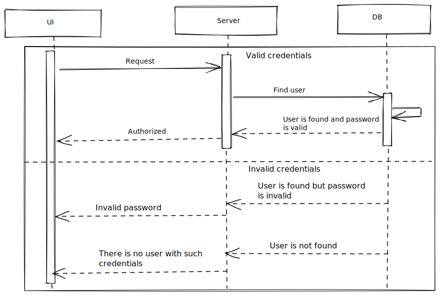

# Login



## Login form

Simple data validation:

- check login is entered;
- check password is entered.

Have a link to restore password form.

## Request

Request body (POST):

```
{
    data: {
        login: string,
        password: string,
    }
}
```

## Response

- If user is found and credentials are valid:

```
{
    data: {
        token: string,
    }
}
```

Token may contain user personal data, it's permissions if any etc.
Do some work on response: keep token and expiration, maybe redirect to some app page (tasks probably).

- If user is found but password is not valid or if user is not found - respond with ther ResponseBodyError interface.

Inform user about the error occured (toast or smth). Highlight form fields.
