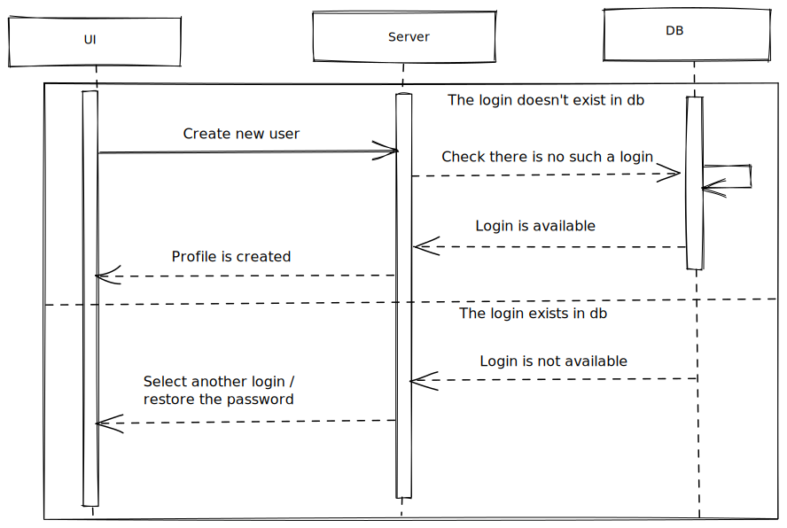

# New user



## New user form

Simple data validation:

- check login is entered;
- check password is entered;
- ask user to confirm password;

## Request

Request body (POST):

```
{
    data: {
        login: string,
        password: string,
    }
}
```

## Response

- If login already exists - respond with the ResponseBodyError interface.
- If login is available:

```
{
    data: {}
}
```

Redirect to `login-page`.
