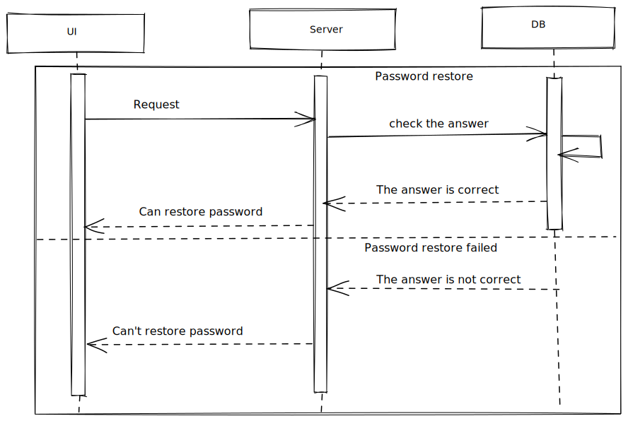

# Password restore



## Password restore form

There are two forms:

- first form with a user login field. The field is required;
- second form with an answer field. The field is required.

## Request

First request to fetch secret question by user login:

Request body (POST):

```
{
    data: {
        name: string,
    }
}
```

Second request should check if answer provided is correct:

Request body (POST):

```
{
    data: {
        name: string,
        answer: string,
    }
}
```

## Response

- if answer is valid:

```
{
    data: {
        status: string,
    }
}
```

Show user two fields where it's possible to enter the new password and confirm it.

- if user is not found with first request the response body should follow the the ResponseBodyError interface. Inform user about it;
- if answer is no valid the response body should follow the the ResponseBodyError interface.
