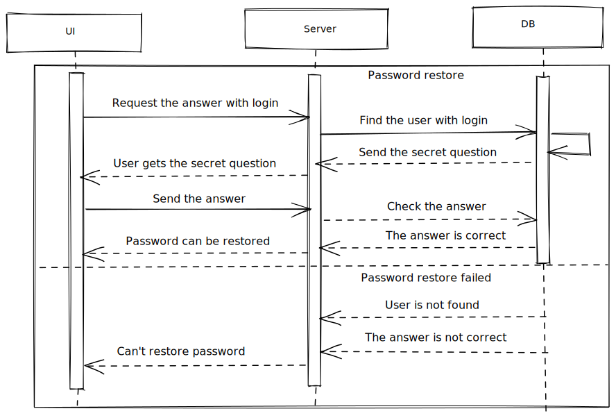

# Password restore



## Password restore form

Simple data validation:

- check the answer is entered.

## Request

Request body (POST):

```
{
    data: {
        answer: string,
    }
}
```

## Response

- if answer is valid:

```
{
    data: {
        status: string,
    }
}
```

Show user two fields where it's possible to enter the new password and confirm it.

- if answer is no valid the response body should follow the the ResponseBodyError interface.
